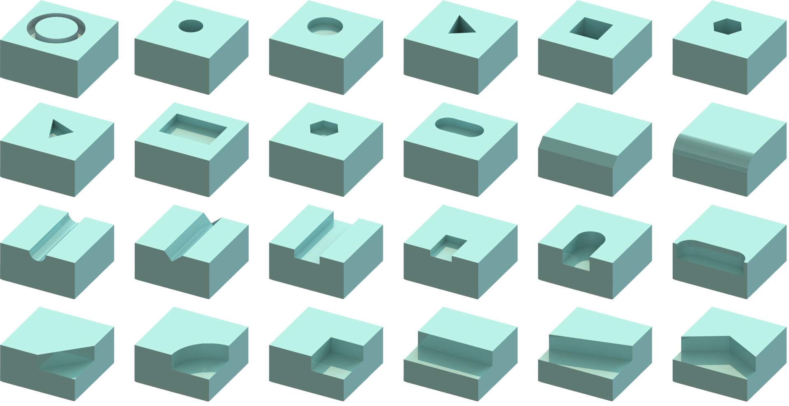
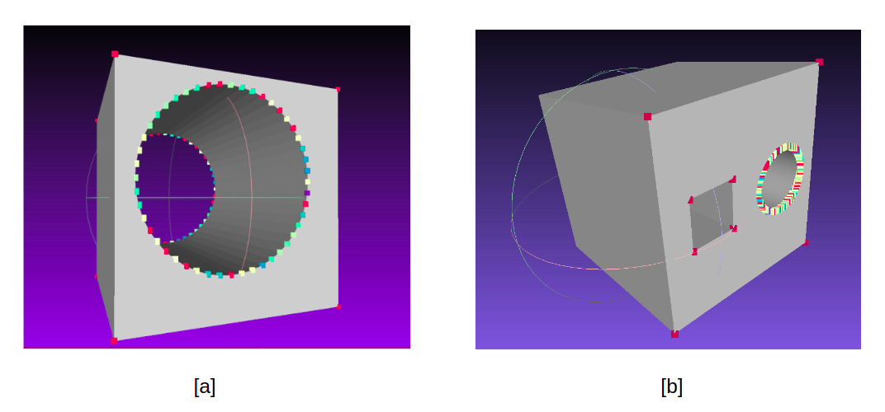
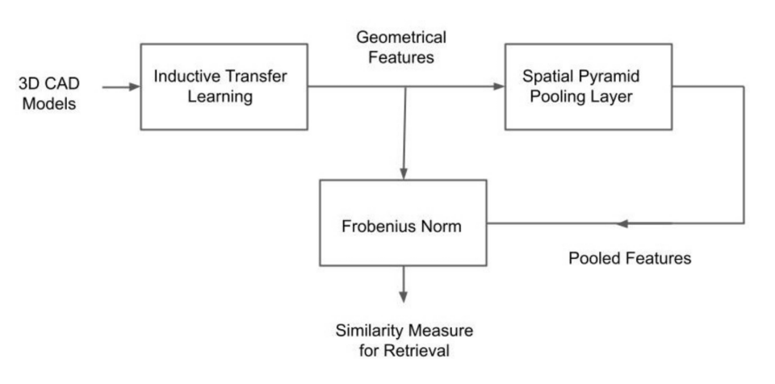
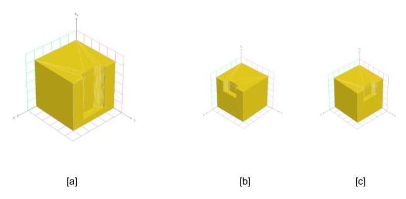

# Geometry Based Machining Feature Retrieval with Inductive Transfer Learning

**Abstract**:Manufacturing industries have widely adopted the reuse of
machine parts as a method to reduce costs and as a sustainable manufacturing practice. Identification of reusable features from the design of the
parts and finding their similar features from the database is an important
part of this process. In this project, with the help of fully convolutional
geometric features, we are able to extract and learn the high level semantic features from CAD models with inductive transfer learning. The
extracted features are then compared with that of other CAD models
from the database using Frobenius norm and identical features are retrieved. Later we passed the extracted features to a deep convolutional
neural network with a spatial pyramid pooling layer and the performance
of the feature retrieval increased significantly. It was evident from the results that the model could effectively capture the geometrical elements from machining features.

The paper is submitted to 9th International Conference on Frontiers of Intelligent Computing: Theory and Applications (FICTA 2021)
: [Preprint](https://arxiv.org/abs/2108.11838)


## 3D CAD Models
The Dataset used for feature retrieval is adopted from the synthetic dataset generated for [FeatureNet](https://github.com/zibozzb/FeatureNet).  It consists of 24 commonly found machining features in the manufacturing industry (e.g., O-ring, Rectangular passage). Each of the 24 classes has 1000 3D CAD models of varying dimensions and orientations in STL format.


*source: https://github.com/zibozzb/FeatureNet* 


## Feature extraction with Inductive Transfer Learning 
An important recent work in geometric feature extraction was using [Fully
Convolutional Geometric Features](https://github.com/chrischoy/FCGF). The model could compute high-level geometric features computed in a single pass by a 3D fully-convolutional network. They have used the Minkowski Engine to handle sparse convolutions. We have adopted the weights of their pretrained model on 3DMatch dataset for our work.
The extracted feature vectors were observed to be 32
Dimensional. The features were projected to three
dimensions with t-Distributed Stochastic Neighbor Embedding(t-SNE) for
visualization purposes.


*[a] Extracted feature vectors of a through hole projected to 3D space and laid over the model. [b] Extracted features of a multi-feature 3d model*


## Machining Feature Retrieval with Frobenius norm and Spatial Pyramid Pooling

The extracted feature vectors should be able to capture the geometrical elements of the machining features. To validate this, the extracted
features needed to be compared with a similarity measure, Frobenius norm ([Notebook 1](Benchmarking_featurenet.ipynb)). To better find the similarity between feature matrices
of different shapes, a deep neural network with a Spatial pyramid pooling(SPP) layer has been used later ([Notebook 2](Machining_feature_retrieval.ipynb)).


*The proposed method for feature extraction and retrieval*


## Results
The inclusion of SPP layer improved the performance of feature retrieval. The
testing accuracy obtained from the model was 86% and the top-5 accuracy was 95%  at the time of publication. With the current model, the accuracy is 92.8 and top-5 acuuracy is 98.5 for 30 epochs.

*  Families of sample files chosen for testing and the top 2 similar families retrieved from database

| Family of Test file|Similar Family 1|Similar Family 2 |
|----------|------------|--------------|
|Rectangular passage | Rectangular pocket | Rectangular blind step|
|Triangular pocket  | Triangular passage | rectangular blind step |
|6 Sides passage |  6 Sides pocket | Circular blind step|
|O-ring | Circular end pocket| Blind Hole

* Top-5 models retrieved for a sample 3D model of 'circular end blind spot' (ID: 1990)

|No.|Model ID|Family|Euclidean Distance|
|----------|------------|-----------------------|-----------------------|
|1 | 1214  | Circular end blind spot | 8.17|
|2 | 1561  | Circular end blind spot | 8.28|
|3 | 1326  | Circular end blind spot | 8.49|
|4 | 1853  | Circular end blind spot | 8.89|
|5 | 1726  | Circular end blind spot | 8.94|


## CAD file visualization
The test file and the top retrieved
CAD model are rendered using the viewscad library. We can observe that the test features and retrieved features even though from the same family are different in dimensions but the network could still capture the similarity between them.


*[a] Test file from the family circular end blind slot. [b] Result no.1 - ID: 1620, Family: Circular end blind slot [c] Result no.2 - ID: 1230, Family: Circular end blind slot*


## Requirements

```sh
Ubuntu 18.04.6 LTS
CUDA 10.2 or higher
Python v3.7 or higher
Pytorch v1.6 or higher
MinkowskiEngine v0.5 or higher
```


## Installation

We have used pip for installations and it is advisable to upgrade pip beforehand.
It is recommended to create a python virtual environment before installation.

First of all install [torch](https://pytorch.org/) matching your cuda version.\
Then install Minkowski engine with the following commands
```sh
sudo apt install build-essential python3-dev libopenblas-dev
pip install torch ninja
pip install -U MinkowskiEngine --install-option="--blas=openblas" -v --no-deps
# If this gives errors follow https://github.com/NVIDIA/MinkowskiEngine
```

You can install the rest of the libraries by running the following command.
```sh
pip install -r requirements.txt
```

For visualization of CAD file you need some additional libraries. Install node-js from [here](https://linuxize.com/post/how-to-install-node-js-on-ubuntu-18.04/) and then install openscad from [here](https://ubuntuhandbook.org/index.php/2019/01/install-openscad-ubuntu-18-10-18-04/).

You can download the featurenet dataset from [here](https://github.com/madlabub/Machining-feature-dataset/blob/master/dataset.rar) or run the the following commands.
```sh
wget -O data/dataset.rar https://github.com/madlabub/Machining-feature-dataset/blob/master/dataset.rar?raw=true
unrar x data/dataset.rar data/
rm -r data/dataset.rar 
```


You can download the pre-trained model for feature extraction by running the following command.
```sh
gdown https://drive.google.com/uc?id=1JuKffwi3qi1FhyQQB9rTbuxwGy7wfaPQ -O model/pretrained/model_32.pth

```

